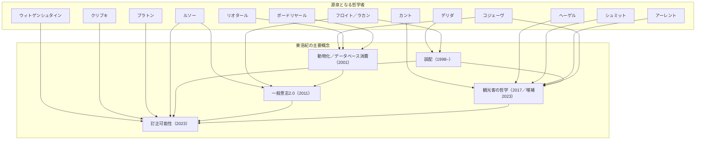
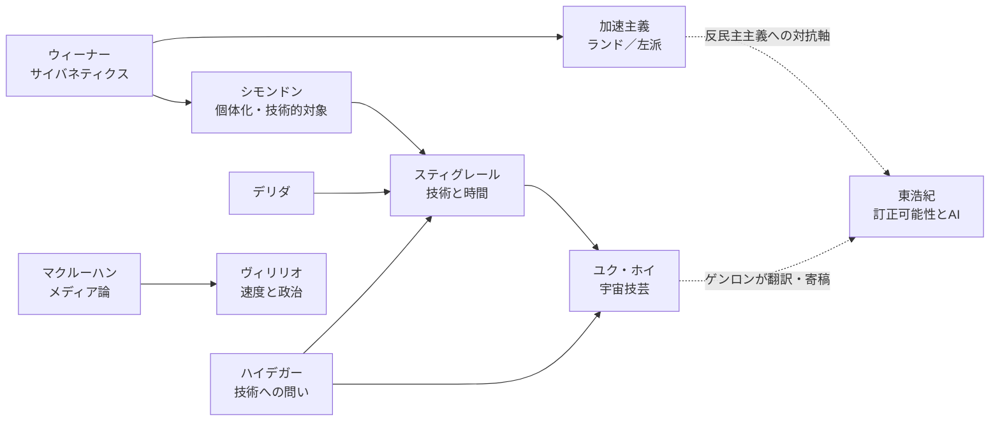

# 東浩紀 思想系譜マップ＋技術への拡張マップ

> **このドキュメントの位置づけ**: 学習の「目的地の地図」。東浩紀の思想がどの哲学者から来てどこへ向かっているかを一望し、それを技術哲学・AI・ECの実務へ拡張するための見取り図。カリキュラム本体ではなく、日々の学習で「いま地図のどこにいるか」を確認するために使う。
>
> 最終更新: 2026-06-10（近年の活動・文献情報はWeb検索で実在確認済み。巻末に出典リンクあり）

---

## 0. 現在地: 東浩紀とゲンロンのいま（2023–2026）

地図を描く前に、目的地である「現在の東浩紀」を確認しておく。

| 年 | 出来事・著作 |
|---|---|
| 2023.6 | 『観光客の哲学 増補版』（ゲンロン）刊行 |
| 2023.9 | **『訂正可能性の哲学』**（ゲンロン）刊行。『観光客の哲学』『一般意志2.0』の続編にして現時点の主著 |
| 2023.10 | 『訂正する力』（朝日新書）刊行。「訂正」概念の実践版・入門版 |
| 2024.9 | ロボット研究者・大澤正彦とNTT OPEN HUBで対談「**“訂正”するAI**」。AI論への応用を本人が展開中 |
| 2024.10 | 『ゲンロン17』刊行。旧ユーゴ取材記「平和について」、暦本純一×清水亮×落合陽一のAI座談会など |
| 2025 | **ZEN大学（2025年開学）知能情報社会学部 教授に就任**。「情報社会×哲学」が公式の持ち場に |
| 2025.5 | 『ゲンロン18』刊行。特集「一族の想像力」。**ユク・ホイが寄稿**（技術哲学との接続が誌面で進行中） |
| 2025.12 | **『平和と愚かさ』**（ゲンロン）刊行。ウクライナ・旧ユーゴ・ベトナム・広島などを歩いた「哲学紀行」による平和論。刊行1ヶ月で3刷 |

**体制**: ゲンロン（2010年創業）の代表は2018年末から上田洋子。東は創業者・編集長として批評誌『ゲンロン』とゲンロンカフェに関与しつつ、2019年設立の動画配信プラットフォーム「シラス」代表を務める。

**AIへのスタンス（重要）**: 東は「人間のコミュニケーションは訂正可能性に支えられている」という立場から、(1) ビッグデータとAIで民意を直接集計する「人工知能民主主義」を『訂正可能性の哲学』第2部で批判し（かつての自著『一般意志2.0』への自己訂正でもある）、(2) AGI開発については「責任を負えないが言い訳だけは人間らしい仮想人間が増えるだけになりかねない」と警告している。**つまり東自身が今まさにAI論の真ん中にいる**。このドキュメントの「技術への拡張」は本人の現在進行形の関心と重なっている。

---

## 1. 主要概念の系譜マップ

### 全体図

ポイントは2つ。

1. **すべての根に「誤配」がある**。デビュー作『存在論的、郵便的』のデリダ論で得たこの概念が、四半世紀かけて観光客論・訂正論へと展開されてきた。
2. **『一般意志2.0』→『観光客の哲学』→『訂正可能性の哲学』は実質的な三部作**で、最後の『訂正可能性』は前二作の自己訂正を含む。東の思想は「過去の自分の訂正」として読むと一本の線になる。

### 1.1 誤配（ごはい）

- **一行説明**: メッセージは宛先どおりには届かない。その配達の失敗＝偶然の到達こそが、新しい出会い・連帯・公共性を生む——というコミュニケーションの原理。
- **元になった哲学者と議論**: ジャック・デリダ。エクリチュール（書かれたもの）は発信者の意図を離れて流通するという脱構築の議論、とくにラカン「手紙は必ず宛先に届く」へのデリダの反論（手紙は届かないことがありうる）。東はこれを「郵便的脱構築」として体系化した。
- **展開された著作**: 『存在論的、郵便的——ジャック・デリダについて』（新潮社、1998／サントリー学芸賞）。以後、『観光客の哲学』では観光客の連帯原理として、『訂正可能性の哲学』では「誤配の時間化＝訂正」として再展開。
- **前提知識**: ソシュール記号論の初歩／プラトン『パイドロス』のパロール・エクリチュール論／ラカン精神分析の概略／ハイデガー存在論の超概略。※原典は難関なので終盤向け。概念自体は『観光客の哲学』経由で序盤に掴める。

### 1.2 動物化／データベース消費

- **一行説明**: 大きな物語を失ったポストモダンの消費者は、物語ではなく設定・キャラ・萌え要素の「データベース」から要素を直接取り出して消費し、他者を介さない即時的満足（＝動物的）へ向かう。
- **元になった哲学者と議論**: アレクサンドル・コジェーヴ『ヘーゲル読解入門』の「歴史の終わり」後の人間像（アメリカ的「動物への回帰」と日本的「スノビズム」）。背景にリオタール「大きな物語の凋落」、ボードリヤールのシミュラークル論、大塚英志『物語消費論』。
- **展開された著作**: 『動物化するポストモダン——オタクから見た日本社会』（講談社現代新書、2001）、続編『ゲーム的リアリズムの誕生』（2007）。
- **前提知識**: ヘーゲル歴史哲学の超概略→コジェーヴ／リオタール『ポストモダンの条件』／90〜00年代オタク文化の文脈。新書なので**最初に読める東浩紀**であり、かつ今日のレコメンド消費・生成AIコンテンツ消費を25年前に先取りした書として読み直せる。

### 1.3 一般意志2.0

- **一行説明**: ルソーの「一般意志」を、熟議ではなくデータベース＝集合的無意識（検索ログ、行動履歴）として読み替え、可視化された「数の民意」を統治に組み込もうとした構想。
- **元になった哲学者と議論**: ルソー『社会契約論』の一般意志（個別意志の総和である「全体意志」とは区別される）。これにフロイトの無意識、グーグルやニコニコ動画のアーキテクチャを掛け合わせた。
- **展開された著作**: 『一般意志2.0——ルソー、フロイト、グーグル』（講談社、2011／講談社文庫、2015）。**重要**: 『訂正可能性の哲学』第2部「一般意志再考」で、この構想の延長にある「人工知能民主主義」（アルゴリズムによる統治の夢）を本人が批判的に訂正している。必ずセットで読む。
- **前提知識**: ルソー『社会契約論』／直接民主主義vs熟議民主主義の論点整理／フロイトの無意識の初歩。

### 1.4 観光客の哲学

- **一行説明**: 国民国家（政治）とグローバル市場（経済）の二層構造の時代に、「まじめな市民」でも「根なしのノマド」でもない**観光客**という軽薄な存在こそが、誤配を通じて他者と出会い直す連帯の主体になる、という政治哲学。
- **元になった哲学者と議論**: カント『永遠平和のために』への応答、ヘーゲルの人倫（家族→市民社会→国家）の組み替え、シュミット「友敵理論」・アーレント「活動」・コジェーヴ「動物」がそれぞれ排除した「私的で軽薄な存在」の救出、ネグリ＆ハート『〈帝国〉』のマルチチュード批判（→「郵便的マルチチュード」）。後半は家族論・ドストエフスキー論。
- **展開された著作**: 『ゲンロン0 観光客の哲学』（ゲンロン、2017／毎日出版文化賞）、『観光客の哲学 増補版』（2023）。実践編として『弱いつながり——検索ワードを探す旅』（幻冬舎、2014）。
- **前提知識**: シュミット『政治的なものの概念』の友敵理論／アーレント『人間の条件』の労働・仕事・活動／ヘーゲル法哲学の概略／グローバリズム論の常識。東の著作で**最初の山頂**。ここを中間目標にすると良い。

### 1.5 訂正可能性

- **一行説明**: 共同体もルールも「実は最初から〜だったのだ」と過去を遡行的に読み替えながら持続する。この「訂正」の働きを保ち続けることこそ民主主義と正義の核心である、という哲学。
- **元になった哲学者と議論**: ウィトゲンシュタイン『哲学探究』の言語ゲーム・家族的類似と、クリプキ『ウィトゲンシュタインのパラドックス』の規則懐疑論（規則の意味は共同体の毎回の判断で事後的に決まる）が核。クリプキ『名指しと必然性』の固有名論、ポパー『開かれた社会とその敵』（とその標的プラトン）、ローティの連帯論、アーレント、そしてルソー再読がこれを支える。
- **展開された著作**: 『訂正可能性の哲学』（ゲンロン、2023）。新書版の実践編が『訂正する力』（朝日新書、2023）。
- **前提知識**: 言語ゲーム／クリプキの規則のパラドックス（クワス算）／固有名と記述の理論／ポパーの開かれた社会。**現時点の東思想の到達点**。AI論（訂正するAI、人工知能民主主義批判）への接続部でもあり、本マップの技術拡張の蝶番になる。

---

## 2. 逆引き: 東浩紀を理解するために学ぶ哲学者・優先順位

「東の概念から逆算して、誰をどの順で学ぶか」のリスト。原典主義にこだわらず、入門書→原典の二段構えを推奨。

### Tier 1 — 必須（東の概念の直接の源泉）

| 優先 | 哲学者 | 効く概念 | 最初に読むもの | 段階 |
|---|---|---|---|---|
| 1 | **ルソー** | 一般意志2.0、訂正可能性 | 『社会契約論』（光文社古典新訳文庫 or 岩波文庫）。原典が短く読みやすい | 序盤〜中盤 |
| 2 | **ウィトゲンシュタイン（→クリプキ）** | 訂正可能性 | 古田徹也『はじめてのウィトゲンシュタイン』（NHKブックス）→ 永井均『ウィトゲンシュタイン入門』（ちくま新書）→ クリプキ『ウィトゲンシュタインのパラドックス』（産業図書） | 中盤 |
| 3 | **デリダ** | 誤配（＝全部の根） | 千葉雅也『現代思想入門』（講談社現代新書、2022）のデリダ章 → 高橋哲哉『デリダ——脱構築と正義』（講談社学術文庫）→ 原典は終盤 | 序盤に入門／終盤に原典 |
| 4 | **コジェーヴ（→ヘーゲル）** | 動物化、観光客 | コジェーヴ『ヘーゲル読解入門』（国文社）。ヘーゲル本体は入門書（『精神現象学』解説系新書）で足りる | 中盤〜終盤 |
| 5 | **プラトン** | 訂正可能性（ポパー経由）、哲学観そのもの | 『ソクラテスの弁明』→『パイドロス』（誤配の源流）→『国家』 | 序盤 |

### Tier 2 — 主要な対話相手（『観光客の哲学』『訂正可能性』の理解に必要）

| 優先 | 哲学者 | 効く概念 | 最初に読むもの | 段階 |
|---|---|---|---|---|
| 6 | **アーレント** | 観光客、訂正可能性 | 矢野久美子『ハンナ・アーレント』（中公新書）→『人間の条件』（ちくま学芸文庫） | 中盤 |
| 7 | **カール・シュミット** | 観光客（友敵理論） | 『政治的なものの概念』（未来社）。薄い | 中盤 |
| 8 | **フーコー** | アーキテクチャ権力論の前提、情報社会論 | 重田園江『ミシェル・フーコー』（ちくま新書）→『監獄の誕生』（新潮社） | 中盤 |
| 9 | **リオタール／ボードリヤール** | 動物化、データベース消費 | 『ポストモダンの条件』（水声社）／『消費社会の神話と構造』（紀伊國屋書店） | 中盤 |
| 10 | **クリプキ（固有名論）** | 訂正可能性、固有名と共同体 | 『名指しと必然性』（産業図書） | 中盤〜終盤 |

### Tier 3 — 深掘り（終盤に効いてくる）

| 優先 | 哲学者 | 効く概念 | 最初に読むもの |
|---|---|---|---|
| 11 | **ローティ** | 訂正可能性（連帯とアイロニー） | 『偶然性・アイロニー・連帯』（岩波書店） |
| 12 | **ポパー** | 訂正可能性（開かれた社会） | 『開かれた社会とその敵』（岩波文庫、全4冊の第1巻だけでも） |
| 13 | **ラカン／フロイト** | 誤配、一般意志2.0（無意識） | 精神分析の入門書1冊で十分（原典は不要） |
| 14 | **ネグリ＆ハート** | 観光客（マルチチュード批判） | 『〈帝国〉』（以文社）は要約・解説経由で可 |
| 15 | **ドストエフスキー** | 観光客の哲学 終章、『平和と愚かさ』 | 『地下室の手記』→『カラマーゾフの兄弟』 |

**読み方の原則**: 東本人の著作を先に読み、「引用元が気になったら遡る」。逆ではない。東は原典の優れた「使い手」なので、本人の要約を地図にして原典に降りるのが最短経路。

---

## 3. 技術哲学への拡張マップ

東浩紀は技術哲学プロパーではない。しかし、(1) ゲンロンがユク・ホイ『中国における技術への問い』を翻訳出版し（2022）、『ゲンロン18』（2025）にもホイが寄稿、(2) 東自身がZEN大学知能情報社会学部教授としてAI論を展開中、という形で**接続は公式に始まっている**。ここから先は「東浩紀的問題系を技術へ延長する」拡張パートであり、ロールモデル（東）に対する自分の独自性（技術の実務家であること）を作る場所になる。

### 3.1 ハイデガー『技術への問い』 — 技術哲学の原点【中盤】

- **一行説明**: 近代技術の本質は「ゲシュテル（総かり立て体制）」であり、自然も人間も「用立て可能な在庫（Bestand）」として現れさせる存在論的枠組みだ、とした技術哲学の出発点。
- **東との接点**: 『存在論的、郵便的』の「存在論的」はハイデガー的脱構築の系譜を指す。また観光客の哲学＝「非本来性（軽薄さ）の肯定」は、ハイデガーの「本来性」重視への明確な反逆として読める。スティグレール・ユク・ホイへの必須の入口。
- **AI時代の論点**: ユーザーを「データという在庫」として扱う発想への批判／「技術は中立な道具」説への反論／効率化一辺倒の思考停止（＝ハイデガーの言う「計算する思考」）。
- **日本語文献**: ハイデッガー『技術への問い』関口浩訳（平凡社ライブラリー、2013）※実在確認済。本体は50頁程度の講演録で、技術哲学の原典では最も手が届きやすい。

### 3.2 マクルーハン — メディアの形式が人間を変える【序盤】

- **一行説明**: 「メディアはメッセージである」——コンテンツではなくメディアの形式そのものが人間の知覚と社会を再編する、としたメディア論の祖。
- **東との接点**: 東の情報社会論（「情報自由論」期）、「観客」をつくるゲンロンの実践、そして石田英敬・東浩紀『新記号論——脳とメディアが出会うとき』（ゲンロン、2019）が直接の接続点。
- **AI時代の論点**: チャットUI・音声エージェントという「新形式」が買い物や思考の様式そのものを変える／グローバル・ビレッジ論のSNS分断への反転。
- **日本語文献**: 入門は服部桂『マクルーハンはメッセージ』（イースト・プレス、2018）※確認済。原典は『メディア論——人間の拡張の諸相』（みすず書房）※確認済。

### 3.3 ウィーナー — サイバネティクス【中盤】

- **一行説明**: フィードバックによる制御と通信の一般理論「サイバネティクス」の創始者。AI・情報社会論すべての源流であり、本人が早くも1950年に自動化の倫理を警告していた。
- **東との接点**: 『一般意志2.0』のデータベース統治はサイバネティック統治の系譜にある。『新記号論』の記号論×脳科学の議論の背景でもある。
- **AI時代の論点**: 推薦システム・自動入札・RLHFはすべてフィードバックループ＝サイバネティクスの子孫。「目的関数を与えた機械は文字どおりにそれを最適化してしまう」というウィーナーの警告はアライメント問題の原型。
- **日本語文献**: 読みやすいのは『人間機械論——人間の人間的な利用 第2版』鎮目恭夫・池原止戈夫訳（みすず書房）※確認済。本格版は『サイバネティックス』（岩波文庫）※確認済。

### 3.4 ヴィリリオ — 速度の政治学【中盤】

- **一行説明**: 「速度」こそが権力であるとするドロモロジー（速度学）の創始者。「新技術の発明は新しい事故の発明である」と論じた技術事故の思想家。
- **東との接点**: 90〜00年代の情報社会論で参照される速度・戦争・メディアの議論は、『ゲンロン17』『平和と愚かさ』の戦争論とも響き合う。
- **AI時代の論点**: リアルタイム化した意思決定の事故（フラッシュクラッシュ、自動売買）／即時性が民主主義の熟議時間を破壊する問題／AI開発競争の「速度の論理」そのもの。
- **日本語文献**: 『速度と政治——地政学から時政学へ』市田良彦訳（平凡社ライブラリー、2001）※確認済。

### 3.5 シモンドン — 個体化と技術的対象【終盤】

- **一行説明**: 技術的対象は単なる道具ではなく独自の進化（具体化）を遂げる存在であり、人間も社会も完成した「個体」ではなく「個体化の過程」として捉えるべきだとした、ドゥルーズ／スティグレールの源流。
- **東との接点**: 東の直接参照は薄いが、スティグレール・ユク・ホイを読むための必須の地下水脈。サイバネティクスの「情報」概念を哲学に組み込んだ先駆でもある。
- **AI時代の論点**: 人間と機械の「主人でも奴隷でもない」協働関係の設計／MLモデルやプロダクトの「具体化」（=技術的対象の成熟）という見方／ユーザーを固定セグメントでなく個体化の過程として見るパーソナライズ批判。
- **日本語文献**: 主著の新訳『技術的対象の存在様態について』（**みすず書房、2025**）※確認済・最新。『個体化の哲学』（法政大学出版局、2018）※確認済。研究書: 宇佐美達朗『シモンドン哲学研究』（法政大学出版局）※確認済。いずれも難度高、終盤向け。

### 3.6 スティグレール — 技術と記憶の哲学【終盤】

- **一行説明**: 人間は本質的に技術によって構成される存在（起源的技術性）であり、外部化された記憶（第三次過去把持）を産業が掌握する「心の産業化」の危機を論じた、デリダの弟子。
- **東との接点**: デリダという共通の師を持つ「同門」。日本へは石田英敬（東の『新記号論』の共著者）が紹介の中心で、問題系はゲンロンと並走している。誤配（デリダ）×技術（ハイデガー）の交点という意味で、東的問題系の技術側の対応物。
- **AI時代の論点**: 注意経済（アテンション・エコノミー）批判の理論的本丸／記憶・知識のデータ化とプラットフォーム支配／AIによるスキルの空洞化（知のプロレタリア化）。
- **日本語文献**: 『技術と時間1 エピメテウスの過失』石田英敬監修・西兼志訳（法政大学出版局、2009、全3巻）※確認済。難解なので、まず石田英敬・東浩紀『新記号論』（ゲンロン、2019）経由で入るのが現実的。

### 3.7 ユク・ホイ — 宇宙技芸と技術多様性【中盤〜終盤】

- **一行説明**: 技術は一つ（西洋近代型）ではなく文化圏ごとに異なる「宇宙技芸（コスモテクニクス）」がありうると唱え、AI時代の技術多様性（テクノダイバーシティ）を主張する香港出身の哲学者。スティグレールの弟子。
- **東との接点**: **拡張マップの最重要人物**。『中国における技術への問い』はゲンロンから刊行され（伊勢康平訳、2022）、『ゲンロン18』（2025）にも寄稿。東の「観光客」＝単一の普遍ではなく複数性から考える哲学と、ホイの「技術の複数性」は直結する。ここが「東浩紀×技術」の現在の最前線。
- **AI時代の論点**: AIのモノカルチャー化への対抗（単一の汎用AIか、多様なAIか）／AI規制・価値観の地域差（EU・米・中）を文明論として読む枠組み／シンギュラリティ言説の批判的検討。
- **日本語文献**: 『中国における技術への問い——宇宙技芸試論』（ゲンロン、2022）※確認済。『再帰性と偶然性』（青土社、2022）、『芸術と宇宙技芸』（春秋社、2024）、『ポストヨーロッパ』（岩波書店、2025）※いずれも確認済。読む順は『中国における技術への問い』が最初。

### 3.8 加速主義とAI倫理 — 現在進行形の戦線【序盤〜中盤】

- **一行説明**: 資本主義と技術の加速によって現状を突破しようとする思想潮流。右派（ニック・ランド：暗黒啓蒙・新反動主義）と左派（スルニチェク＆ウィリアムズ）に分岐し、シリコンバレーのe/acc（効果的加速主義）対AI安全派の論争の思想的背景になっている。
- **東との接点**: 東は90年代サイバースペース論からキャリアを始めており、ランドのCCRU（サイバネティック文化研究ユニット）と同時代の空気を共有する。そして暗黒啓蒙の「民主主義は遅くて非効率だから捨てろ」という主張に対し、東の「訂正可能性」は**民主主義の遅さを擁護する正面からの対抗軸**として読める。ここが時事に最も効く対立軸。
- **AI時代の論点**: e/acc vs AI安全（doomer）論争の系譜的理解／ティール、マスク、ヴァンスらテック右派の思想的背景（新反動主義）／AGI開発競争をイデオロギーとして読む視点。
- **日本語文献**: 木澤佐登志『加速主義〈増補新版〉ニック・ランドと新反動主義』（**星海社新書、2025年11月**。マスクやヴァンスへの言及を増補した最新版）※確認済。左派側はニック・スルネック（スルニチェク）『プラットフォーム資本主義』大橋完太郎・居村匠訳（人文書院、2022）※確認済。AI倫理の教科書はM. クーケルバーク『AIの倫理学』直江清隆訳者代表（丸善出版、2020）※確認済。

---

## 4. AI・ECの実務に効く20のレンズ

ニュース・技術トレンド・事業判断を「思想の語彙」で読み直すためのレンズ集。EC×AIの仕事（ストア分析、レコメンド、広告、価格、生成AI活用）に響くものを優先して選定。「段階」は本カリキュラムでそのレンズが使えるようになる目安。

| # | レンズ | 出典 | 一言説明 | EC×AI実務への適用例 | 段階 |
|---|---|---|---|---|---|
| 1 | **誤配** | 東浩紀（←デリダ） | 意図しない宛先への到達が価値を生む | レコメンドに意図的なノイズ・セレンディピティを設計する根拠。「精度100%のレコメンド」はむしろ出会いを殺す、という事業判断の言語化 | 序盤 |
| 2 | **データベース消費** | 東浩紀 | 物語ではなく要素の組み合わせを消費する | 商品タグ・属性検索・UGC切り抜き消費の理解。生成AIによる「要素の無限リミックス」コンテンツの消費構造を25年前に説明済み | 序盤 |
| 3 | **動物化** | 東浩紀（←コジェーヴ） | 他者なしの即時的満足への最適化 | ワンクリック購入・ショート動画コマース・「考えさせないUX」の功罪を語る枠。CVR最適化の行き着く先はどこかという問い | 序盤 |
| 4 | **一般意志2.0** | 東浩紀（←ルソー） | データの集計が「民意」として立ち上がる | レビュー集計・売れ筋ランキング・レコメンドは「数の意志」の可視化装置。それを熟議（編集・キュレーション）とどう組み合わせるかという設計問題 | 序盤〜中盤 |
| 5 | **訂正可能性** | 東浩紀（←ウィトゲンシュタイン／クリプキ） | ルールは運用の中で遡行的に書き換わる | AIガバナンス・利用規約・アルゴリズム変更の正当性を考える枠。「最初から決めきれない。訂正し続けられる設計が正しい」というアジャイル思想の哲学的根拠 | 序盤〜中盤 |
| 6 | **観光客** | 東浩紀 | コミットしない来訪者こそが価値を運ぶ | ライトユーザー・一見客を「薄い客」と切り捨てない戦略。コミュニティコマースの開放性設計。ファンマーケ一辺倒への解毒剤 | 序盤 |
| 7 | **アーキテクチャ権力** | レッシグ／東浩紀らの00年代論争 | コードとUIが法より強く行動を規定する | ダークパターン規制、デフォルト設定の倫理、カゴ落ち防止UIはどこから「操作」になるか、の判断基準 | 序盤 |
| 8 | **パノプティコン→監視資本主義** | フーコー→ズボフ | 見られている意識が行動を変える／行動データが商品になる | 行動トラッキング・Cookie規制・ゼロパーティデータの議論を読む枠。「行動余剰」の搾取と顧客との信頼設計 | 中盤 |
| 9 | **シミュラークル** | ボードリヤール | オリジナルなきコピーが現実を置き換える | 生成AIコンテンツ・AIモデル画像・フェイクレビューの氾濫。AIがAI生成物を学習する「モデル崩壊」はシミュラークルの自己増殖そのもの | 中盤 |
| 10 | **大きな物語の終焉** | リオタール | 全員が共有する物語が崩壊し小さな物語が乱立する | マス広告の終焉とパーソナライズドマーケの思想的意味。ブランドナラティブが「セグメントごとの小さな物語」に分解される現象 | 序盤 |
| 11 | **疎外** | マルクス | 労働の成果と過程が労働者から切り離される | ギグワーカー・倉庫労働のアルゴリズム管理、アノテーション労働、「AIに評価される働き方」を論じる基本語彙 | 中盤 |
| 12 | **ファルマコン** | デリダ／スティグレール | 薬と毒は同じものの両面 | レコメンドもSNSもスクリーンタイムも「毒か薬か」の二択ではなく用量・用法の問題として設計する、という議論の型 | 中盤 |
| 13 | **第三次過去把持（注意経済）** | スティグレール | 記憶が技術に外部化され産業に掌握される | 購買履歴・閲覧履歴は「外部化された顧客の記憶」。それを預かる責任、アテンションを奪い合う設計の倫理、リテンション施策の哲学的限界 | 終盤 |
| 14 | **個体化** | シモンドン | 人もシステムも完成体でなく生成の過程 | 「顧客セグメント」という静的な箱の限界。顧客は属性の束ではなく個体化の途中にある、という動的パーソナライズの思想 | 終盤 |
| 15 | **宇宙技芸（技術多様性）** | ユク・ホイ | 技術は文化ごとに複数ありうる | EU AI Act・米国・中国のAI規制の違いを「文明の技術観の違い」として読む。越境ECのローカライズを単なる翻訳でなく技術観の翻訳として捉える | 中盤 |
| 16 | **メディアはメッセージ** | マクルーハン | 形式そのものが効果である | チャットコマース・音声エージェント導入は「同じ商品を別の言い方で売る」のではなく購買行動そのものを変える、という判断枠。LLMという「メディア」の効果分析 | 序盤 |
| 17 | **ドロモロジー（速度の権力）** | ヴィリリオ | 速い者が支配し、速度は事故を生む | 即配競争・リアルタイムプライシング・自動入札の暴走。「速度を上げる投資」は常に「新しい事故の発明」とセットだというリスク評価の枠 | 中盤 |
| 18 | **フィードバック制御** | ウィーナー | 出力を入力に戻すループが系を制御する | KPIループ・レコメンドのフィルターバブル・RLHF・自動入札はすべて同型。「目的関数を文字どおり最適化してしまう機械」というアライメント問題の原型 | 中盤 |
| 19 | **加速主義** | ニック・ランド／左派加速主義 | 加速で突破か、減速で統治か | e/acc vs AI安全論争、テック右派（ティール、マスク）のニュースを系譜で読む。自社のAI導入速度の意思決定にも「加速の思想」は潜む | 序盤 |
| 20 | **プラットフォーム資本主義** | スルニチェク | データ独占がプラットフォームを資本主義の中心にした | モール依存 vs 自社EC、データの囲い込み、手数料経済の構造分析。EC事業者の戦略的ポジショニングを資本主義論として語る枠 | 序盤 |

**使い方**: ニュースを読んだら「どのレンズが当たるか」を1つ選んでノートに3行書く。これが「語れるようになる」ための最小の筋トレになる。

---

## 5. 学習カリキュラム上の位置づけ（序盤／中盤／終盤）

毎日30〜45分・数年継続の前提で、このマップの内容がいつ手に入るかの目安。

### 序盤（〜6ヶ月目安）: 東浩紀本人と「見取り図」

- **読むもの**: 『訂正する力』→『動物化するポストモダン』→『弱いつながり』→『観光客の哲学 増補版』→『ゲンロン戦記』。並行して千葉雅也『現代思想入門』、服部桂『マクルーハンはメッセージ』、木澤佐登志『加速主義〈増補新版〉』、スルニチェク『プラットフォーム資本主義』。時事接続に『平和と愚かさ』。
- **手に入るレンズ**: #1 誤配、#2 データベース消費、#3 動物化、#6 観光客、#7 アーキテクチャ、#10 大きな物語、#16 メディア、#19 加速主義、#20 プラットフォーム（＋#4/#5 の入門版）
- **到達点**: 東浩紀の主要概念を自分の言葉で一通り説明でき、ニュースにレンズを当てたメモが書ける。

### 中盤（6ヶ月〜2年目安）: 源泉への遡行と技術哲学の古典

- **読むもの**: 『一般意志2.0』＋ルソー『社会契約論』、『訂正可能性の哲学』＋ウィトゲンシュタイン入門＋クリプキ、アーレント・シュミット・フーコー・ボードリヤール・リオタールの入門→主著。技術側はハイデガー『技術への問い』、マクルーハン『メディア論』、ウィーナー『人間機械論』、ヴィリリオ『速度と政治』、『新記号論』、ユク・ホイ『中国における技術への問い』、クーケルバーク『AIの倫理学』。
- **手に入るレンズ**: #4 一般意志2.0、#5 訂正可能性（フル版）、#8 パノプティコン／監視資本主義、#9 シミュラークル、#11 疎外、#12 ファルマコン、#15 宇宙技芸、#17 ドロモロジー、#18 フィードバック
- **到達点**: 「東浩紀は◯◯を△△と読み替えた」という系譜の語りができる。AI規制・加速主義のニュースを思想の対立軸として解説できる。アウトプットをX・ブログへ。

### 終盤（2年〜）: 原典深掘りと技術哲学の前線

- **読むもの**: 『存在論的、郵便的』＋デリダ原典、コジェーヴ『ヘーゲル読解入門』＋ヘーゲル、ローティ、ポパー、ネグリ＆ハート。技術側はシモンドン『技術的対象の存在様態について』（2025年新訳）・『個体化の哲学』、スティグレール『技術と時間』、ユク・ホイ『再帰性と偶然性』『ポストヨーロッパ』。
- **手に入るレンズ**: #13 第三次過去把持、#14 個体化（＋#1 誤配の原典レベルの理解）
- **到達点**: 東浩紀の系譜の上に「技術の実務家としての自分の論」を接ぎ木できる。＝「東浩紀よりもっと技術を絡めた」固有のポジションの土台が完成。

### 段階早見表

| 段階 | 東浩紀 | 源泉哲学者 | 技術哲学 | レンズ獲得数（累計） |
|---|---|---|---|---|
| 序盤 | 新書・主著の通読 | プラトン、入門書群 | マクルーハン入門、加速主義入門 | 9〜11 |
| 中盤 | 三部作の精読＋AI論 | ルソー、ウィトゲンシュタイン、アーレント、シュミット、フーコー | ハイデガー、ウィーナー、ヴィリリオ、ユク・ホイ（ゲンロン版） | 18 |
| 終盤 | 『存在論的、郵便的』 | デリダ、コジェーヴ／ヘーゲル、ローティ、ポパー | シモンドン、スティグレール、ユク・ホイ（理論書） | 20 |

---

## 6. 出典・参照リンク（2026-06-10 Web確認）

### 東浩紀・ゲンロンの現在
- [ゲンロン公式](https://genron.co.jp/)／[webゲンロン 東浩紀](https://webgenron.com/authors/2)
- [『平和と愚かさ』（ゲンロンショップ）](https://shop.genron.co.jp/products/9784907188672)／[3刷プレスリリース](https://prtimes.jp/main/html/rd/p/000000042.000034496.html)
- [『ゲンロン18』](https://shop.genron.co.jp/products/889)／[批評誌『ゲンロン』バックナンバー](https://webgenron.com/articles/genron_backissues)
- [東浩紀 - Wikipedia（ZEN大学教授就任ほか）](https://ja.wikipedia.org/wiki/%E6%9D%B1%E6%B5%A9%E7%B4%80)
- [「人工知能民主主義の誕生」『訂正可能性の哲学』抜粋（webゲンロン）](https://webgenron.com/articles/article20230922_01)
- [東浩紀×大澤正彦「“訂正”するAI」対談（NTT OPEN HUB, 2024）](https://openhub.ntt.com/journal/11137.html)
- [『訂正可能性の哲学』電子版（紀伊國屋書店）](https://www.kinokuniya.co.jp/f/dsg-08-EK-1573178)

### 技術哲学の日本語文献（実在確認済）
- [ユク・ホイ『中国における技術への問い』特設サイト（ゲンロン）](https://webgenron.com/articles/anessayincosmotechnics)／[刊行プレスリリース](https://prtimes.jp/main/html/rd/p/000000021.000034496.html)
- [ユク・ホイ『芸術と宇宙技芸』書評（美術手帖）](https://bijutsutecho.com/magazine/series/s12/30382)／[『ポストヨーロッパ』（岩波書店）](https://www.iwanami.co.jp/book/b10146259.html)
- [シモンドン『技術的対象の存在様態について』（みすず書房、2025）](https://www.msz.co.jp/book/detail/09762/)／[『個体化の哲学』（紀伊國屋書店）](https://www.kinokuniya.co.jp/f/dsg-01-9784588010835)
- [スティグレール『技術と時間1』（法政大学出版局）](https://books.rakuten.co.jp/rb/6131276/)
- [ハイデッガー『技術への問い』（平凡社ライブラリー）](https://www.kinokuniya.co.jp/f/dsg-01-9784582768008)
- [木澤佐登志『加速主義〈増補新版〉ニック・ランドと新反動主義』（星海社、2025）](https://seikaisha.co.jp/books/shinsho/b6msfnq6eqg/)
- [ウィーナー『人間機械論 第2版』（みすず書房）](https://www.msz.co.jp/book/detail/07883/)
- [ヴィリリオ『速度と政治』（平凡社ライブラリー）](https://www.kinokuniya.co.jp/f/dsg-01-9784582764000)
- [マクルーハン『メディア論』（みすず書房）](https://www.msz.co.jp/book/detail/01897/)／[服部桂『マクルーハンはメッセージ』（イースト・プレス）](https://www.eastpress.co.jp/goods/detail/9784781616704)
- [スルネック『プラットフォーム資本主義』（人文書院）](https://www.jimbunshoin.co.jp/book/b613937.html)
- [クーケルバーク『AIの倫理学』（丸善出版）](https://www.maruzen-publishing.co.jp/book/b10121110.html)

> **注**: 上記以外の古典（ルソー、アーレント等）の書誌は定番版を記載したが、版・訳の選択は購入時に最新の在庫状況で確認すること。本マップは学習の進行に応じて訂正されることを前提とする——それ自体が「訂正可能性」の実践である。
